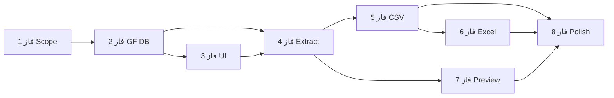

# Roadmap — نقشه راه توسعه

## نمای کلی — 8 فاز

```
فاز 1 ──► فاز 2 ──► فاز 3 ──► فاز 4 ──► فاز 5 ──► فاز 6 ──► فاز 7 ──► فاز 8
 Scope     GF DB     UI        Extract    CSV       Excel     Preview   Polish
```

## فاز 1: تعریف دقیق نیازها و ساختار خروجی

**هدف:** تکمیل scope MVP

**خروجی:**

- [x] لیست فرم‌ها، انتخاب، بازه تاریخ، CSV/Excel تأیید شده
- [x] تصمیم: خروجی کامل vs فیلدهای خاص → **All fields**
- [x] ساختار ستون‌ها نهایی (`GFA_Export_Config`)
- [x] رفتار تاریخ خالی (`GFA_Date_Range`)
- [x] فرمت فایل‌ها (CSV UTF-8 BOM + XLSX)

**وضعیت:** ✅ — scaffold افزونه `0.1.0`

---

## فاز 2: بررسی ساختار Gravity Forms و دیتابیس

**هدف:** شناخت دقیق جداول و فیلدها

**خروجی:**

- [x] شناسایی جدول‌های مورد نیاز (`GFA_GF_Schema`)
- [x] روش خواندن entryها → **GFAPI** (نه SQL مستقیم)
- [x] mapping فیلدها و labelها (`GFA_Field_Mapper`)
- [x] نمونه کوئری تست (`probe()` + `wp gfa probe <id>`)

**وضعیت:** ✅ — `GFA_Data_Extractor` + batching

**نکته:** GFAPI برای پایداری across versions انتخاب شد؛ composite fields به‌صورت sub-input جدا export می‌شوند.

---

## فاز 3: ساخت UI انتخاب فرم و فیلتر تاریخ

**هدف:** صفحه مدیریتی اولیه

**خروجی:**

- [x] لیست فرم‌ها + checkbox
- [x] date range picker
- [x] دکمه export (بدون تولید فایل واقعی)
- [x] validation سمت client/server

**وضعیت:** ✅ — `GFA_Admin_Page` + assets

**نکته:** هنوز خروجی فایل ساخته نمی‌شود.

---

## فاز 4: پیاده‌سازی موتور استخراج داده

**هدف:** خواندن داده و آماده‌سازی رکوردها

**خروجی:**

- [x] دریافت entryهای فرم‌های انتخاب‌شده
- [x] اعمال فیلتر تاریخ
- [x] ساختار unified data (`GFA_Export_Row`)
- [x] unit/integration test با داده نمونه (`tests/run-unit-tests.php`, `wp gfa extract`)

**وضعیت:** ✅ — `GFA_Export_Engine` + batching

**نکته:** مهم‌ترین فاز فنی MVP.

---

## فاز 5: تولید خروجی CSV

**هدف:** اولین فرمت قابل دانلود

**خروجی:**

- [x] فایل CSV قابل دانلود
- [x] encoding UTF-8 BOM
- [x] header استاندارد

**وضعیت:** ✅ — `GFA_Csv_Exporter` + admin download

**چرا اول CSV:** سریع‌تر و کم‌ریسک‌تر.

---

## فاز 6: تولید خروجی Excel

**هدف:** XLSX

**خروجی:**

- [x] فایل Excel با همان data model
- [x] باز شدن در Excel / Google Sheets

**وضعیت:** ✅ — `GFA_Xlsx_Exporter` + admin download

**نکته:** Writer سبک بدون Composer (ZipArchive + OOXML).

---

## فاز 7: پیش‌نمایش و شمارش رکوردها

**هدف:** شفافیت قبل از دانلود

**خروجی:**

- [x] تعداد فرم‌های انتخاب‌شده
- [x] تعداد رکوردها
- [x] هشدار فرم‌های بدون داده

**وضعیت:** ✅ — `GFA_Export_Preview` + AJAX admin preview

---

## فاز 8: بهینه‌سازی و توسعه‌های بعدی

**هدف:** آماده‌سازی برای نسخه‌های بعد

**موارد قابل افزودن:**

- تاریخچه اکسپورت
- هشدار فرم‌های قدیمی فعال
- preset انتخاب‌های پرتکرار
- فیلترهای بیشتر
- Export mode: phone fields only
- capability سفارشی
- API

---

## مسیر فشرده (4 فاز)

| # | فاز | شامل |
|---|-----|------|
| 1 | تحلیل | ساختار GF + scope |
| 2 | UI | انتخاب فرم + date range |
| 3 | Export core | استخراج + CSV |
| 4 | Polish | Excel + validation + preview |

مناسب تحویل سریع‌تر MVP.

## وابستگی فازها


