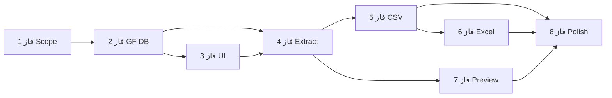

# Roadmap — نقشه راه توسعه

## نمای کلی — 8 فاز

```
فاز 1 ──► فاز 2 ──► فاز 3 ──► فاز 4 ──► فاز 5 ──► فاز 6 ──► فاز 7 ──► فاز 8
 Scope     GF DB     UI        Extract    CSV       Excel     Preview   Polish
```

## فاز 1: تعریف دقیق نیازها و ساختار خروجی

**هدف:** تکمیل scope MVP

**خروجی:**

- [ ] لیست فرم‌ها، انتخاب، بازه تاریخ، CSV/Excel تأیید شده
- [ ] تصمیم: خروجی کامل vs فیلدهای خاص → **All fields**
- [ ] ساختار ستون‌ها نهایی
- [ ] رفتار تاریخ خالی
- [ ] فرمت فایل‌ها

**وضعیت:** ✅ (مستندات این repo)

---

## فاز 2: بررسی ساختار Gravity Forms و دیتابیس

**هدف:** شناخت دقیق جداول و فیلدها

**خروجی:**

- [ ] شناسایی جدول‌های مورد نیاز
- [ ] روش خواندن entryها (SQL vs GFAPI)
- [ ] mapping فیلدها و labelها
- [ ] نمونه کوئری تست

**نکته:** مشخص می‌شود کوئری مستقیم کافی است یا GFAPI بهتر است.

---

## فاز 3: ساخت UI انتخاب فرم و فیلتر تاریخ

**هدف:** صفحه مدیریتی اولیه

**خروجی:**

- [ ] لیست فرم‌ها + checkbox
- [ ] date range picker
- [ ] دکمه export (بدون تولید فایل واقعی)
- [ ] validation سمت client/server

**نکته:** هنوز خروجی فایل ساخته نمی‌شود.

---

## فاز 4: پیاده‌سازی موتور استخراج داده

**هدف:** خواندن داده و آماده‌سازی رکوردها

**خروجی:**

- [ ] دریافت entryهای فرم‌های انتخاب‌شده
- [ ] اعمال فیلتر تاریخ
- [ ] ساختار unified data
- [ ] unit/integration test با داده نمونه

**نکته:** مهم‌ترین فاز فنی MVP.

---

## فاز 5: تولید خروجی CSV

**هدف:** اولین فرمت قابل دانلود

**خروجی:**

- [ ] فایل CSV قابل دانلود
- [ ] encoding UTF-8 BOM
- [ ] header استاندارد

**چرا اول CSV:** سریع‌تر و کم‌ریسک‌تر.

---

## فاز 6: تولید خروجی Excel

**هدف:** XLSX

**خروجی:**

- [ ] فایل Excel با همان data model
- [ ] باز شدن در Excel / Google Sheets

**نکته:** اگر پیچیده شد → فاز بعد.

---

## فاز 7: پیش‌نمایش و شمارش رکوردها

**هدف:** شفافیت قبل از دانلود

**خروجی:**

- [ ] تعداد فرم‌های انتخاب‌شده
- [ ] تعداد رکوردها
- [ ] هشدار فرم‌های بدون داده

---

## فاز 8: بهینه‌سازی و توسعه‌های بعدی

**هدف:** آماده‌سازی برای نسخه‌های بعد

**موارد قابل افزودن:**

- تاریخچه اکسپورت
- هشدار فرم‌های قدیمی فعال
- preset انتخاب‌های پرتکرار
- فیلترهای بیشتر
- Export mode: phone fields only
- capability سفارشی
- API

---

## مسیر فشرده (4 فاز)

| # | فاز | شامل |
|---|-----|------|
| 1 | تحلیل | ساختار GF + scope |
| 2 | UI | انتخاب فرم + date range |
| 3 | Export core | استخراج + CSV |
| 4 | Polish | Excel + validation + preview |

مناسب تحویل سریع‌تر MVP.

## وابستگی فازها


